Brand & Campaign Management Solution Template Documentation
===========================================================

# Table of Contents
1. [Introduction](#introduction)
2. [Architecture](#architecture)
3. [System Requirements](#system-requirements)
4. [How to Install](#how-to-install)
5. [Architecture Deep Dive](#architecture-deep-dive)
6. [Model Schema](#model-schema)
7. [Reports Walkthrough](#report-walkthrough)
8. [Customizations](#customizations)
9. [Estimated Costs](#estimated-costs)


### Introduction

The Twitter template spins up a complete brand/campaign solution. It stands up an end-to-end solution that pulls data from Twitter, enriches the data using machine learning and stores it in Azure SQL. Users can then use pre-built Power BI reports that leverage Microsoft research technology to start analyzing their Twitter data and augmenting it with additional data sources.

The template is aimed at anyone who is interesting in analyzing Twitter data. It supports multiple personas ranging from a marketing manager monitoring the success of their campaign to a ministry official interested in tracking the public’s reactions on social media.

The template lets you do things like:

-   Understand what aspects of your product/campaign/event are well received and immediately spot the biggest concerns and pain points

-   Track what topics are trending and how that changes across time

-   Identify your biggest influencers fans and critics

The following document provides a walkthrough of the architecture, a deep dive into every component, comments on customizability as well as information on additional topics like pricing. For any questions not covered in this document, please contact the team at <PBISolnTemplates@microsoft.com>

### Architecture


The flow of the Twitter solution template is as follows:

-   Logic Apps pull data from Twitter

-   Logic App passes tweet into an Azure Function

-   Azure Function enriches tweet and writes it to Azure SQL

-   Azure Function also calls Azure ML experiment running Python script to work out sentiment of tweet

-   Power BI imports data into it from Azure SQL and renders pre-defined reports

### System Requirements

Setting up the template requires the following:

-   Access to an Azure subscription

-   Power BI Desktop (latest version)

-   Power BI Pro (to share the template with others)

-   Twitter Account

### How to Install

Before diving into the components of the solution, we will go through how to set things up. To get started with the solution, navigate to the [Twitter template page](https://powerbi.microsoft.com/en-us/solution-templates/brand-management-twitter) and click **Install Now**.

**Getting Started:** Starting page introducing the template and explaining the architecture.

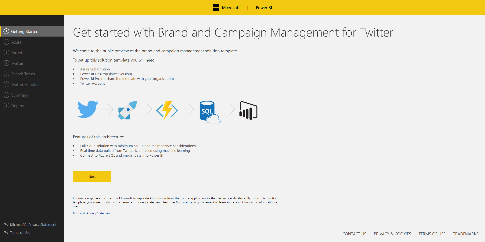

**Azure:** Use OAuth to sign into your Azure account. You will notice you have a choice between signing into an organizational account and a Microsoft (work/school account).

If you select a Microsoft account, you will need to provide the application with a domain directory. You can find your domain by logging into your Azure account and choosing from those listed when you click your e-mail in the top right hand corner:


If you belong to a single domain, simply hover over your e-mail address in the same place:


In this case, the domain is: richtkhotmail.362.onmicrosoft.com.

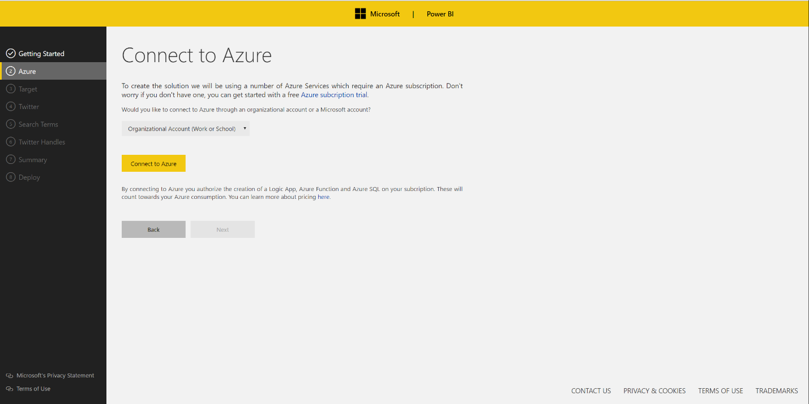
Logging into Azure gives the application access to your Azure subscription and permits spinning up Azure services on your behalf. If you want a more granular breakdown of the costs, please scroll down to the Estimated Costs section.

As a user navigates away from this page a new resource group gets spun up on their Azure subscription (the name is random but always prefixed by ‘SolutionTemplate-‘). This name can be changed under the advanced settings tab. All newly created resources go into this container.

**Target:** Connect to an existing SQL Server or provide details which the application will use to spin up an Azure SQL on your behalf. Only Azure SQL is supported for this template. If a user chooses to spin up a new Azure SQL, this will get deployed in their Azure subscription inside the newly created resource group.

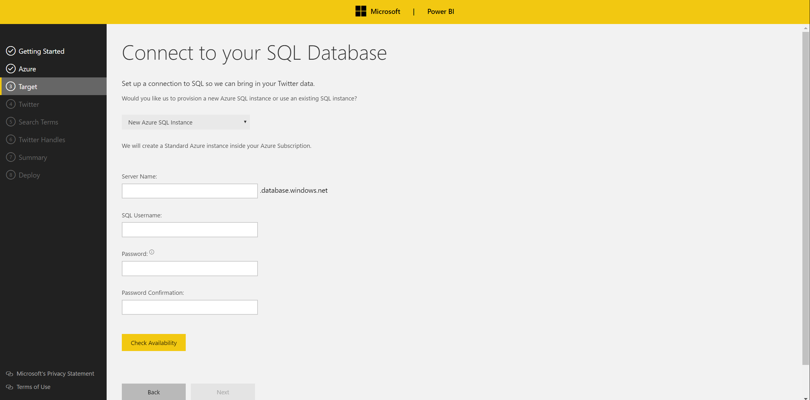

**Cognitive Services:** Congitive services are an Azure service that does textual analytics incuding sentiment analysis. Choose between spinning up a new cognitive service on your subscription or selecting an existing one. If you want to use an existing service you can log into your Azure account, find they key for the cognitive service and copy paste it into the installer.

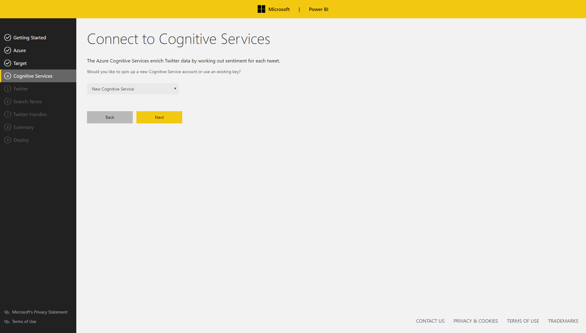

**Twitter:** Use OAuth to sign into a Twitter account. The application will sign into this Twitter account inside the Logic App and use it to pull tweets (this will not have any impact on your Twitter account). We will never post tweets on behalf of a user.

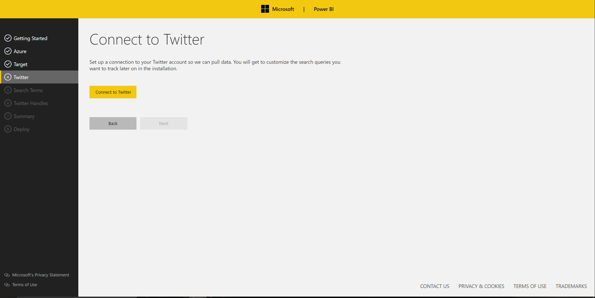

**Search Terms:** Input the search terms you are interested in tracking. Tweets that match your search terms will be pulled from Twitter via the Logic App. Logic Apps supports any queries that the Twitter Search API supports. Guidelines are available [here](https://dev.twitter.com/rest/public/search). If you would like to learn how you can change your search terms once the solution is deployed, please look at the ‘Customizations’ section.

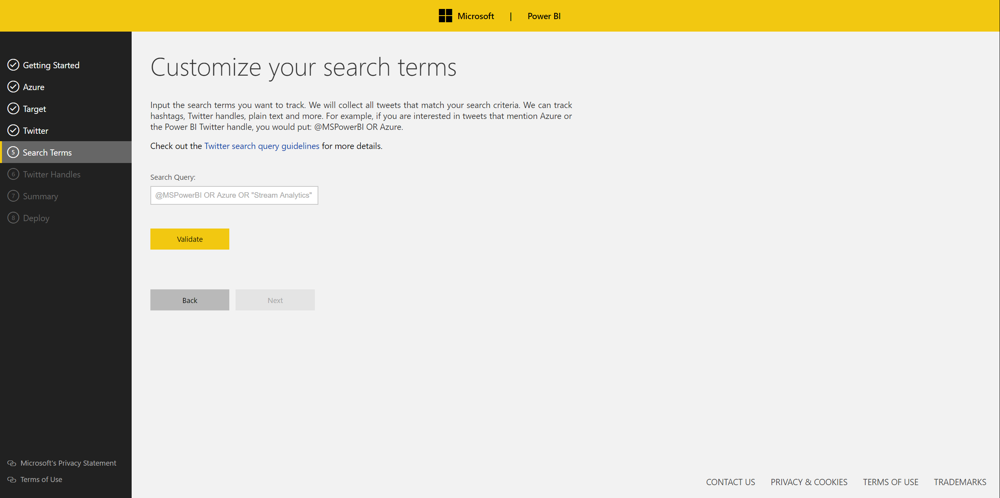

**Twitter Handles:** The template can enrich the data that comes in with the tweet direction. In order to do that it needs to know which specific Twitter handles you are interested in tracking. Please input these into the Twitter handle box as demonstrated in the example. If you would like to learn how you can change your Twitter Handles after the solution is deployed, please look at the ‘Customizing solution’ section.

**Azure Analysis Services Selection**

Choose whether Azure Analysis Services is to be used in the solution

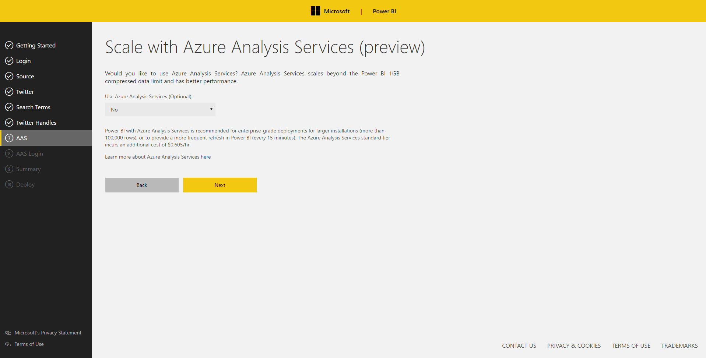

**Configure Azure Analysis Services (Optional)**

If Azure Analysis Services was chosen, create a new instance of Analysis Services or use an existing one.

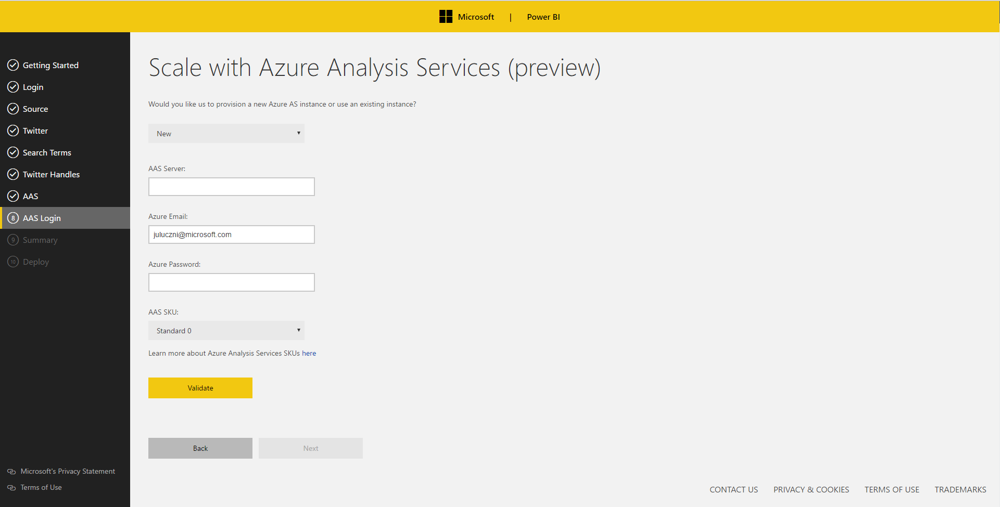

For new instances, select the Azure Analysis Services service tier. Learn more about Azure Analysis Services service tiers [here](https://azure.microsoft.com/en-us/pricing/details/analysis-services/).

The credentials provided are used as the system administrator for the Azure Analysis Services instance. When connecting to this instance, these credentials must be used (unless other users have been provided access separately).
**Summary:** Summary page outlining all the choices the user made.

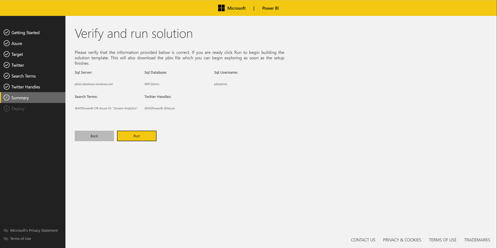

**Deploy:** When you navigate to the deployment page the setup process gets kicked off. SQL scripts run to create the necessary tables and views. An Azure Function then gets spun up on your Azure subscription. An Azure ML webservice is deployed to your subscription that will do the sentiment scoring. Finally, a Logic App is created that has a connection to your Azure Function.

**It is important that you do not navigate away from this page while deployment takes place.** Once everything gets deployed a download link will appear for a Power BI file which consists of the pre-defined reports.

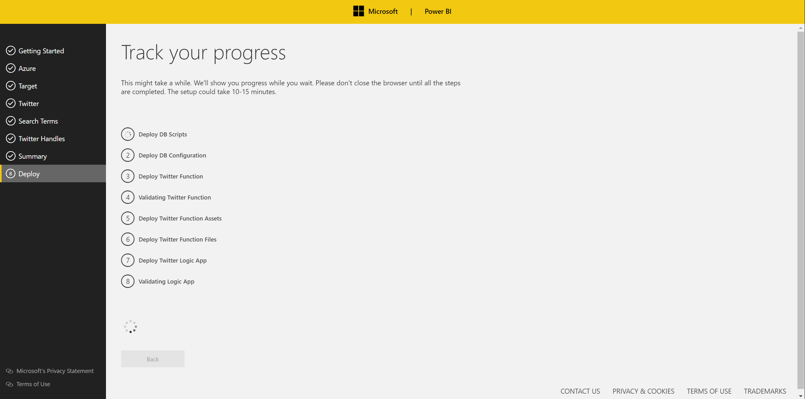

**Power BI File:** Once you download the Power BI desktop file you will need to connect it to your data. Open the pbix and follow the instructions on the front page (**it is important you do this before publishing the file to the Power BI Service. If this is not done the solution will not work inside the Service).**

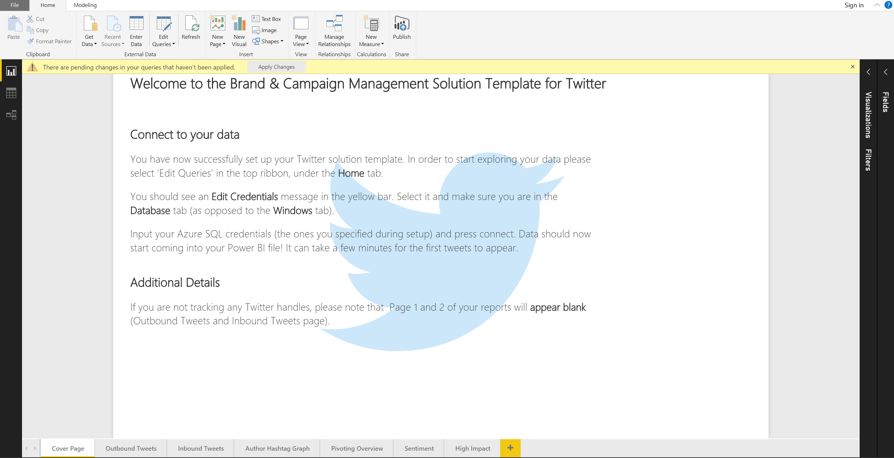

Architecture Deep Dive
======================

The following section will break down how the template works by going through all the components of the solution.


Azure Resources:
----------------

You can access all of the resources that have been spun up by logging into the Azure portal. Everything should be under one resource group (unless a user was using an existing SQL server. In this case the SQL Server will appear in whatever resource group it already existed in).

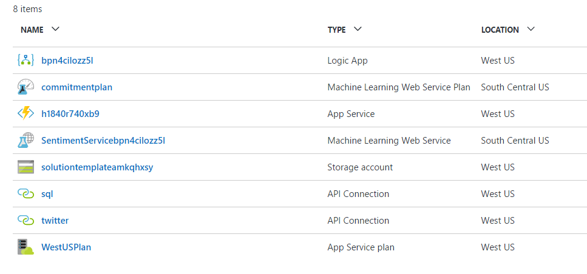Here is an example of what gets spun up for a user. We will go through each of these items one by one:


### Logic App:

Logic Apps are an Azure service for building integrated solutions. You can easily build business logic flows that consist of various actions and triggers. This is the workflow we spin up using our template:


The Logic App consists of two steps: a **trigger** (when a new tweet appears) and an **action** (Azure Function running python script).

In this particular example, the Logic App tracks all tweets that contain the phrase ‘Game of Thrones’. When a new tweet is found that contains this phrase, the JSON body of the tweet gets passed into an Azure Function. You can customize the search queries in your trigger whenever you want. Updating the search queries will update which tweets get collected.

You can also customize the frequency at which tweets are brought in. In this example, Twitter gets scanned every 3 minutes and tweets that were created in the past 3 minutes and that match the search terms get brought in.

Whatever tweets are found in the 3-minute interval, are batched up and sent sequentially through the Azure Function. We will go into more detail about what gets done inside the function next.


### Azure ML Web Service:

The Azure Machine Learning web service is called inside the Azure Function (covered in the next section). In the case of the template, we only deploy the web service and not the experiment itself so the code cannot be changed (this is due to ease of deployment rather than protecting IP). The code inside the Azure ML experiment is as follows:

```Python#
# The entry point function can contain up to two input arguments:
#   Param<dataframe1>: a pandas.DataFrame
#   Param<dataframe2>: a pandas.DataFrame

def azureml_main(dataframe1 = None, dataframe2 = None):

text = dataframe1.Text[0]
lines_list = tokenize.sent_tokenize(text)  
# takes tweet text and takes out individual words and separates them into an array

sid = SentimentIntensityAnalyzer()  

# instantiates the class that will do sentiment analysis   

composite = 0  

# initiates initial starting score

for line in lines_list:        
	ss = sid.polarity_scores(line)  
	# give you the sentiment for a line        
	composite += float(ss['compound'])  
	# adds up all the sentiments       
	# for now, just average the scores together     
	sentiment = composite / len(lines_list) 
	# finds average sentiment  
	result = pd.DataFrame({\"text\" : [text], \"score\": [sentiment]}, index = [1])
return result

```


### Azure Function: 

A JSON payload of the tweet gets sent into the newly created Azure Function which consists of a C# script. When the function was spun up the run file was updated to the specific script below. 

The Run method reads the tweet + all of it's metadata in from the request and parses this information. It also saves the connection string needed for connecting to SQL.

```C#
public static async Task<object> Run(HttpRequestMessage req, TraceWriter log)
{
    // Read all connectionstrings and keys for SQL
    string connectionString = System.Configuration.ConfigurationManager.ConnectionStrings["connectionString"].ConnectionString;
    TweetHandler tweetHandler = new TweetHandler(connectionString);
    
    // Read json string from request and parse tweets
    string jsonContent = await req.Content.ReadAsStringAsync();
    var tweets = JsonConvert.DeserializeObject(jsonContent);
    if (tweets is JArray)
    {
        foreach (var item in (JArray)tweets)
        {
            var individualtweet = item.ToString();
            tweetHandler.ParseTweet(individualtweet);
        }
    }
    else
    {
        tweetHandler.ParseTweet(jsonContent);
    }

    // log.Info($"{data}");

    //Return status ok if no exception encountered
    return req.CreateResponse(HttpStatusCode.OK, "");
}

```

Inside the ParseTweet method we parse the tweet +metadata and read in the Twitter handles and Twitter handle IDs that the user wants to track (this was defined on the Twitter Handles page). The Twitter handles and IDs come from the SQL ‘Configuration table’. The handles and IDs are saved into a  dictionary.

```C#
    public async Task<bool> ParseTweet(string entireTweet)
    {
        // Convert JSON to dynamic C# object
        tweetObj = JObject.Parse(entireTweet);
        tweet = tweetObj;

        //Connect to Azure SQL Database & bring in Twitter Handles & IDs
        string twitterHandles =
            ExecuteSqlQuery("select value FROM pbist_twitter.configuration where name = \'twitterHandle\'", "value");
        string twitterHandleId =
            ExecuteSqlQuery("select value FROM pbist_twitter.configuration where name = \'twitterHandleId\'",
                "value");

        // Split out all the handles & create dictionary
        String[] handle = null;
        String[] handleId = null;
        var dictionary = new Dictionary<string, string>();

        if (twitterHandles != String.Empty)
        {
            handle = SplitHandles(twitterHandles, ',');
            handleId = SplitHandles(twitterHandleId, ',');
            for (int index = 0; index < handle.Length; index++)
            {
                dictionary.Add(handle[index], handleId[index]);
            }
        }
```        
We currently support English, Spanish, French and Portugese for sentiment detection. Assuming the tweet is in one of those languages the sentiment is worked out. We do this by calling the sentiment Cognitive API (MakeSentimentRequest method). The score gets discretized and a categorical variable is defined which indicates whether the tweet is positive, negative or neutral.


```
        // Check if language of tweet is supported for sentiment analysis
        originalTweets["lang"] = tweet.TweetLanguageCode.ToString();
        if (originalTweets["lang"] == "en" || originalTweets["lang"] == "fr" || originalTweets["lang"] == "es" || originalTweets["lang"] == "pt")
        {
            //Sentiment analysis - Cognitive APIs 
            string sentiment = await MakeSentimentRequest(tweet);
            sentiment = (double.Parse(sentiment) * 2 - 1).ToString(CultureInfo.InvariantCulture);
            string sentimentBin = (Math.Floor(double.Parse(sentiment) * 10) / 10).ToString(CultureInfo.InvariantCulture);
            string sentimentPosNeg = String.Empty;
            if (double.Parse(sentimentBin) > 0)
            {
                sentimentPosNeg = "Positive";
            }
            else if (double.Parse(sentimentBin) < 0)
            {
                sentimentPosNeg = "Negative";
            }
            else
            {
                sentimentPosNeg = "Neutral";
            }

            //Save sentiment and language metadata into dictionary
            originalTweets["sentiment"] = sentiment;
            originalTweets["sentimentBin"] = sentimentBin;
            originalTweets["sentimentPosNeg"] = sentimentPosNeg;
        }
        else
        {
            originalTweets["sentimentPosNeg"] = "Undefined";
        }
```
The next step is to work out the ‘direction’ of the tweet. The script looks at the twitter handles brought in and checks whether a match is found in the JSON body of the tweet + metadata. Since there could be a discrepancy between the tweets brought in and the twitter handles followed, it isn’t a given that a direction will be found. For this reason, the account is initialized to ‘unknown’.  The account gets overwritten and the tweet direction populated if a match is found.

Before continuing with the script, here are details about what each tweet ‘direction’ means (the example we go through is of someone following the Microsoft twitter handle):

inbound: I am tweeting ‘@Microsoft’/to:Microsoft

outbound: Tweet by ‘Microsoft’

inboundRT: I am retweeting someone else’s ‘@Microsoft’/to:Microsoft tweet

outboundRT: ‘Microsoft’ is retweeting my tweet

inboundReply: I am replying to a tweet from Microsoft

outboundReply: ‘Microsoft’ is replying to a tweet I tweeted ‘@Microsoft’/to:Microsoft

inboundReplyRT: I am retweeting a tweet that was someone tweeted @Microsoft/to:‘Microsoft’

RTofoutbound: I am retweeting a tweet that was originally posted by ‘Microsoft’

Hashtag: I am using \#Microsoft in the tweet

HashtagRT: I am retweeting a tweet that uses \#Microsoft

Text: I am tweeting with Microsoft mentioned in the tweet text (not @Microsoft or \#Microsoft)

RTText: I am retweeting a tweet that mentions Microsoft in the tweet text (not @Microsoft or \#Microsoft)

Once we work out the tweet direction we save the tweet text + metadata like author information, sentiment into the originalTweets table.

```C#
        // Work out account and tweet direction for retweets
        if (tweet.OriginalTweet != null)
        {
            processedTweets["direction"] = "Text Retweet";
            originalTweets["twitterhandle"] = tweet.OriginalTweet.UserDetails.UserName;
            if (dictionary.Count > 0)
            {
                foreach (var entry in dictionary)
                {
                    HashtagDirectionCheck(entry, " Retweet");
                    MessageDirectionCheck(entry, tweetObj.SelectToken("OriginalTweet.UserMentions"), " Retweet");
                }
            }
            // Save retweets into SQL table
            saveTweets(tweet.OriginalTweet);
        }
        // Works out the tweet direction for original tweets (not retweets)
        else
        {
            originalTweets["twitterhandle"] = tweet.UserDetails.UserName;
            if (dictionary.Count > 0)
            {
                foreach (var entry in dictionary)
                {
                    HashtagDirectionCheck(entry);
                    MessageDirectionCheck(entry, tweetObj.SelectToken("UserMentions"));
                }
            }
            
            // Save original tweets into SQL Table
            saveTweets(tweet);
        }
            
 ```
 We then pull out more metadata from the tweet such as timestamps, image links, how many times a tweet was retweet and how many followers the author has:
 
```C#
        processedTweets["tweetid"] = tweet.TweetId;

        //Save time metadata about processed tweets
        string createdat = tweet.CreatedAt.ToString();
        DateTime ts = DateTime.ParseExact(createdat, "ddd MMM dd HH:mm:ss +ffff yyyy", CultureInfo.CurrentCulture);
        processedTweets["dateorig"] = DateTime.Parse(ts.Year.ToString() + " " + ts.Month.ToString() + " " + ts.Day.ToString() + " " + ts.Hour.ToString() + ":" + ts.Minute.ToString() + ":" + ts.Second.ToString()).ToString(CultureInfo.InvariantCulture);
        processedTweets["minuteofdate"] = DateTime.Parse(ts.Year.ToString() + " " + ts.Month.ToString() + " " + ts.Day.ToString() + " " + ts.Hour.ToString() + ":" + ts.Minute.ToString() + ":00").ToString(CultureInfo.InvariantCulture);
        processedTweets["hourofdate"] = DateTime.Parse(ts.Year.ToString() + " " + ts.Month.ToString() + " " + ts.Day.ToString() + " " + ts.Hour.ToString() + ":00:00").ToString(CultureInfo.InvariantCulture);
        

        //Save media and follower metadata about processed tweets
        processedTweets["authorimage_url"] = tweet.UserDetails.ProfileImageUrl;
        processedTweets["username"] = tweet.UserDetails.UserName;
        processedTweets["user_followers"] = tweet.UserDetails.FollowersCount;
        processedTweets["user_friends"] = tweet.UserDetails.FavouritesCount;
        processedTweets["user_favorites"] = tweet.UserDetails.FriendsCount;
        processedTweets["user_totaltweets"] = tweet.UserDetails.StatusesCount;
        
                string firstUrl = String.Empty;

        if (tweetObj.SelectToken("MediaUrls") != null && tweetObj.SelectToken("MediaUrls").HasValues)
        {
            firstUrl = tweet.MediaUrls[0];
            if (firstUrl != String.Empty)
            {
                processedTweets["image_url"] = firstUrl;
            }
        }

        if (tweet.favorited != "true")
        {
            processedTweets["favorited"] = "1";
        }

        if (tweet.OriginalTweet != null)
        {
            processedTweets["retweet"] = "True";
        }
```

At this point we have collected all the information we need. We just need to write the information into the right SQL table. To learn more about the schema please go to the data model section:

```C#
        //Save processed tweets into SQL
        int response = 0;
        response = ExecuteSqlScalar(
            $"Select count(1) FROM pbist_twitter.tweets_processed WHERE tweetid = '{processedTweets["tweetid"]}'");
        if (response == 0)
        {
            try
            {
                ExecuteSqlNonQuery(generateSQLQuery("pbist_twitter.tweets_processed", processedTweets));
            }
            catch (Exception e) { }
        }

        string text = tweet.TweetText.ToString();
        //Populate hashtag slicer table
        if (text.Contains("#"))
        {
            hashtagSlicer["tweetid"] = tweet.TweetId;
            hashtagmentions(text, '#', "facet", "pbist_twitter.hashtag_slicer", hashtagSlicer);
        }

        //Populate author hashtag network table
        if (text.Contains("#"))
        {
            authorHashtagGraph["tweetid"] = tweet.TweetId;
            authorHashtagGraph["author"] = tweet.UserDetails.UserName;
            hashtagmentions(text, '#', "hashtag", "pbist_twitter.authorhashtag_graph", authorHashtagGraph);
        }

        //Populate mention slicer table
        if (text.Contains("@"))
        {
            mentionSlicer["tweetid"] = tweet.TweetId;
            hashtagmentions(text, '@', "facet", "pbist_twitter.mention_slicer", mentionSlicer);
        }

        //Populate author mention network table
        if (text.Contains("@"))
        {
            authorMentionGraph["tweetid"] = tweet.TweetId;
            authorMentionGraph["author"] = tweet.UserDetails.UserName;
            hashtagmentions(text, '@', "mention", "pbist_twitter.authormention_graph", authorMentionGraph);
        }
```


### Model Schema


Here is an overview of the tables found in the model:

| **Table Name**       | **Description **                                                                                                                                                                                                                                              |
|----------------------|---------------------------------------------------------------------------------------------------------------------------------------------------------------------------------------------------------------------------------------------------------------|
| Author Hashtag Graph | Stores hashtag and author information optimized for creating a network graph                                                                                                                                                                                  |
| Author Mention Graph | Stores mentions and author information optimized for creating a network graph                                                                                                                                                                                 |
| Configuration        | Configuration table storing parameters for the template to function correctly                                                                                                                                                                                 |
| Hashtag Slicer       | Stores every hashtag found with its corresponding tweet ID. This can be used to filter tweets to those that only contain the hashtag of interest                                                                                                              |
| Mention Slicer       | Stores every mention found with its corresponding tweet ID. This can be used to filter tweets to those that only contain the mentions of interest                                                                                                             |
| Original Tweets      | Stores original tweets with their original authors and sentiment (every tweet is unique)                                                                                                                                                                      |
| Tweets               | Stores information about every processed tweet such as the tweet direction, author and author information. It does not store the tweet itself, instead referencing the original tweet table. This table stores retweet as well as original tweet information. |
| Minimum Tweets       | A disconnected table used to filter out the minimum number of tweets to be displayed on a page. For example, if we select a minimum of 5 tweets, a chart that groups tweets by author will only display authors who have tweeted at least 5 tweets.           |

Below is a breakdown of the columns found in every table (*DAX measures and Calculated Columns in italic)*:

| **Author Hashtag Graph** |                                          |
|--------------------------|------------------------------------------|
| **Column Name**          | **Description**                          |
| Tweet ID                 | Tweet Id (includes retweeted tweets)     |
| Author                   | Author name                              |
| Author Color             | Hex color (used for network graph nodes) |
| Hashtag                  | Hashtag used in tweet (\#)               |
| Hashtag Color            | Hex color (used for network graph nodes) |

| **Author Mention Graph** |                                          |
|--------------------------|------------------------------------------|
| **Column Name**          | **Description**                          |
| Tweet ID                 | Tweet Id (includes retweeted tweets)     |
| Author                   | Author name                              |
| Author Color             | Hex color (used for network graph nodes) |
| Mention                  | Mention used in tweet (@)                |
| Mention Color            | Hex color (used for network graph nodes) |

| **Hashtag Slicer** |                                      |
|--------------------|--------------------------------------|
| **Column Name**    | **Description**                      |
| Tweet Id           | Tweet Id (includes retweeted tweets) |
| Facet              | Hashtag used in tweet (\#)           |

| **Mention Slicer** |                                      |
|--------------------|--------------------------------------|
| **Column Name**    | **Description**                      |
| Tweet Id           | Tweet Id (includes retweeted tweets) |
| Facet              | Mention used in tweet (@)            |

| **Minimum Tweets**    |                                                                                                                   |
|-----------------------|-------------------------------------------------------------------------------------------------------------------|
| **Column Name**       | **Description**                                                                                                   |
| Minimum Tweets        | Values ranging from 1-100 (used in a slicer, these can define the minimum number of tweets to consider on a page) |
| *MinTweetsToConsider* | *DAX measure used to filter charts based on the value of ‘Minimum Tweets’*                                        |

| **Original Tweets**         |                                                                                                                                                                                                           |
|-----------------------------|-----------------------------------------------------------------------------------------------------------------------------------------------------------------------------------------------------------|
| **Column Name**             | **Description**                                                                                                                                                                                           |
| Master Id                   | Tweet Id (stores each individual tweet - no retweets)                                                                                                                                                     |
| Mentions                    | Currently not used                                                                                                                                                                                        |
| Hashtags                    | Currently not used                                                                                                                                                                                        |
| Tweet                       | Tweet text                                                                                                                                                                                                |
| Twitter Handle              | Handle of the tweet author                                                                                                                                                                                |
| User Number                 | Currently not used                                                                                                                                                                                        |
| Sentiment                   | Sentiment of tweet (measured on scale of -1 to 1 where -1 is very negative and 1 is very positive)                                                                                                        |
| Sentiment Bin               | Sentiment group a tweet falls in (e.g. a tweet with sentiment 0.36 would fall into group 0.3, a tweet with sentiment -0.22 would fall into group -0.2                                                     |
| Sentiment Positive/Negative | Tweets with sentiment 0 get put in the 'neutral' category, those above 0 get a positive group and below 0 get a negative grouping                                                                         |
| Language                    | Language tweet is in                                                                                                                                                                                      |
| Account Tag                 | Default value is unknown, if the tweet is matched to a tracked Twitter handle (e.g. tweeted from account or the Twitter handle is mentioned in the tweet) then the account tag is updated to that account |

| **Tweets**        |                                                                                                                        |
|-------------------|------------------------------------------------------------------------------------------------------------------------|
| **Column Name**   | **Descrpition**                                                                                                        |
| *%ofUniqueTweets* | *The percentage of original tweets *                                                                                   |
| Author Image URL  | A URL to the image of the author of the tweet                                                                          |
| Date              | Tweet date                                                                                                             |
| Direction         | Tweet direction (the different directions are outlined in the document)                                                |
| Favorited         | Currently not used                                                                                                     |
| Hours             | Time of tweet rounded to the nearest hour                                                                              |
| Image URL         | If images were included with the tweet this is the URL to the first image attached                                     |
| *isLast7Days*     | *Calculated column: Flag of whether a tweet occurred in the last 7 days*                                               |
| Latitude          | Currently not used                                                                                                     |
| *Link*            | *Link to tweet*                                                                                                        |
| Longitude         | Currently not used                                                                                                     |
| Master Id         | Tweet Id for original tweets (each master ID can be linked to multiple Tweet IDs)                                      |
| Minutes           | Time of tweet rounded to the nearest minute                                                                            |
| Original Date     | Time of tweet                                                                                                          |
| Retweet           | Currently not used                                                                                                     |
| Tweet Id          | Tweet ID (includes IDs for retweets)                                                                                   |
| User Favorites    | How many things did the author favorite                                                                                |
| User Followers    | How many followers does the tweet author have                                                                          |
| User Friends      | How many friends does the tweet author have                                                                            |
| User Number       | Currently not used                                                                                                     |
| User Total Tweets | How many tweets did the tweet author tweet                                                                             |
| Username          | Twitter handle of the author (if the tweet is a retweet then the author is the retweet author not the original poster) |

Report Walkthrough
------------------

The following section walks through each report page outlining the intent of the page. Throughout the Twitter reports the template will often reference the ‘direction’ of a tweet. As a reminder, here is the outline of the direction definitions:

inbound: I am tweeting ‘@Microsoft’/to:Microsoft

outbound: Tweet by ‘Microsoft’

inboundRT: I am retweeting someone else’s ‘@Microsoft’/to:Microsoft tweet

outboundRT: ‘Microsoft’ is retweeting my tweet

inboundReply: I am replying to a tweet from Microsoft

outboundReply: ‘Microsoft’ is replying to a tweet I tweeted ‘@Microsoft’/to:Microsoft

inboundReplyRT: I am retweeting a tweet that was someone tweeted @Microsoft/to:‘Microsoft’

RTofoutbound: I am retweeting a tweet that was originally posted by ‘Microsoft’

Hashtag: I am using \#Microsoft in the tweet

HashtagRT: I am retweeting a tweet that uses \#Microsoft

Text: I am tweeting with Microsoft mentioned in the tweet text (not @Microsoft or \#Microsoft)

RTText: I am retweeting a tweet that mentions Microsoft in the tweet text (not @Microsoft or \#Microsoft)

### 
Outbound Tweets:

If you are tracking any accounts, you will be able to see all the tweets and retweets tweeted **from** that account here. You will also see any retweets of the outbound tweets from external. You will be able to see how many outbound tweets occurred by tweet direction across time, what are the top trending tweets (based on the number of retweets) as well as high level statistics like average sentiment and the total followers impacted.

**Please note that if you are not tracking Twitter handles this page will be empty.**

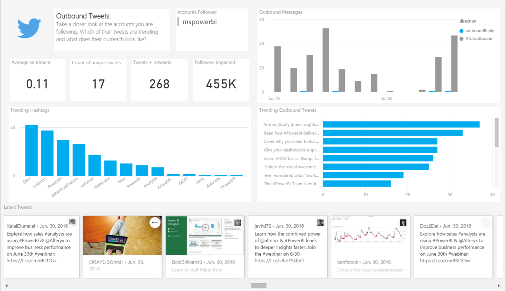

### Inbound Tweets:

If you are tracking any accounts, you will be able to see all the tweets and retweets tweeted **to** that account here. You will be able to see how many inbound tweets occurred by tweet direction across time, what are the top trending tweets (based on the number of retweets) as well as high level statistics like average sentiment and the total followers impacted.

**Please note that if you are not tracking Twitter handles this page will be empty.**

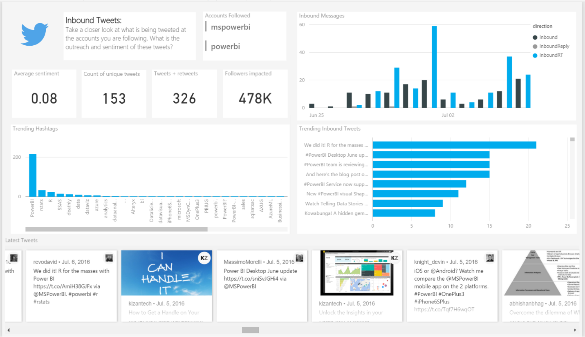

### Author Hashtag Graph

This page allows you to explore a network graph of the hashtags that are being discussed on Twitter as well as how the hashtags are connected to each other. The dark nodes represent hashtags and colored nodes represent the authors.

-   A connection between a hashtag and author indicated the author’s tweet(s) contained that hashtag.

-   Multiple connections from an author to hashtag indicates the author is talking about many hashtags.

-   A hashtag that is connected to many authors indicates lots of people are talking about a specific hashtag

The bottom graph shows the volume of tweets coming in across time. This can also be used as a slicer to zoom into a specific time period.

You can also see which authors are most influential in your network i.e. tweeting systematically.

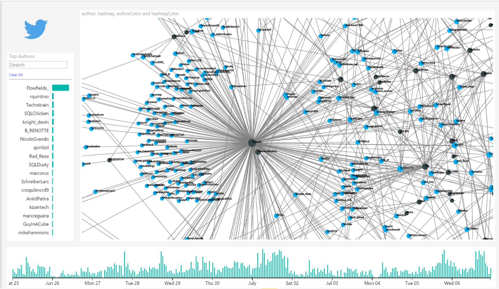

### Pivoting Overview

The pivoting overview page allows you to drill into a combination of authors, hashtags and tweet direction to focus on specific areas of interest. For example, if I notice a combination of hashtags trending on the network page I can select those to see what specific tweets are being tweeted. I can also get some quick, important statistics about those tweets such as a sentiment overview as well as the ratio of retweets to original tweets.

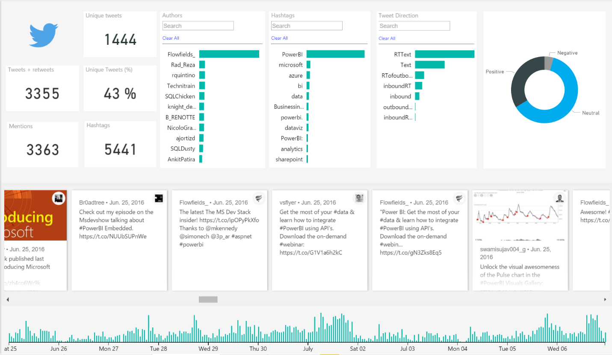

### Sentiment Analysis

This page allows you to monitor the sentiment of your tweets. The left hand side lets you quickly identify your top fans/haters or topics of concern/excitement. The report displays sentiment on the x axis and the volume of tweets on the y axis. Tweets are grouped by either authors (top left hand corner) or hashtags (middle left hand side). Tweets appearing in the top left hand corner of the graph are a cause of concern (tweets that are consistently negative) whereas top right hand corner tweets indicate lots of positivity.

You can also drill into a specific sentiment bin to quickly isolate e.g. only the most negative tweets or only the neutral tweets. You can also see how sentiment changes across time.

Finally, the top right hand corner has a slicer that lets you define the minimum number of tweets you want to see on the screen. For example, if you want to see only authors who have tweeted at least 3 tweets you would set the slicer value to 3.

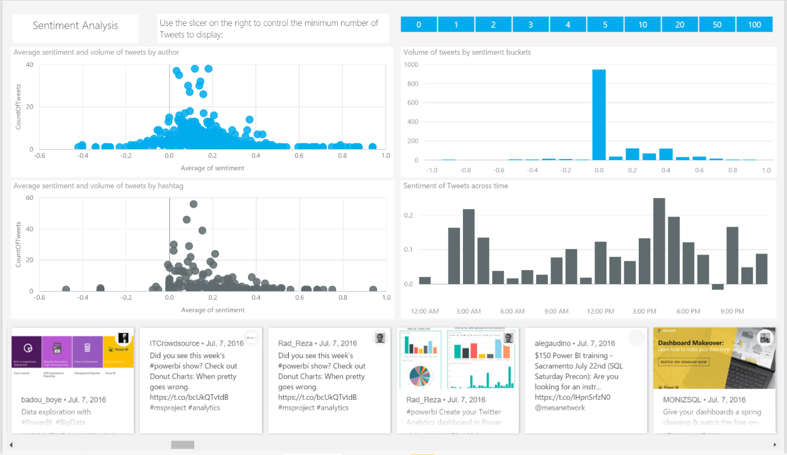

### High Impact

The aim of this page is to help users monitor the most influentialtTweets. A user can use the ‘Table Sorter’ visual to define which variables it considers to define an influential tweet (by default 6 variables are selected). This is explained in further detail underneath the visual. A user can also do things like define the weighting of a variable (e.g. if sentiment is extremely important to me, I can give sentiment a weighting of 4 which will resort the table). All variables are normalized so they operatore on the same scale from 0-100.

Clicking on a tweet will cross filter the ‘influence’ stats on the left hand side to just the selected tweets (i.e. the sentiment, number of retweets etc). Here is an explanation of the default 6 variables:

-   **Sentiment:** The sentiment of the tweet

-   **Reteweets:** The number of times the tweet was retweeted

-   **User Favorites:** The sum of all the tweets users who tweeted + retweeted the tweet favorited

-   **Total User Tweets:** The sum of all the tweets users who tweeted + retweeted the tweet tweeted

-   **Friends Impacted:** The sum of all the friends of the users who tweeted + retweeted the tweet

-   **Followers Impacted:** The sum of all the followers of the users who tweeted + retweeted the tweet

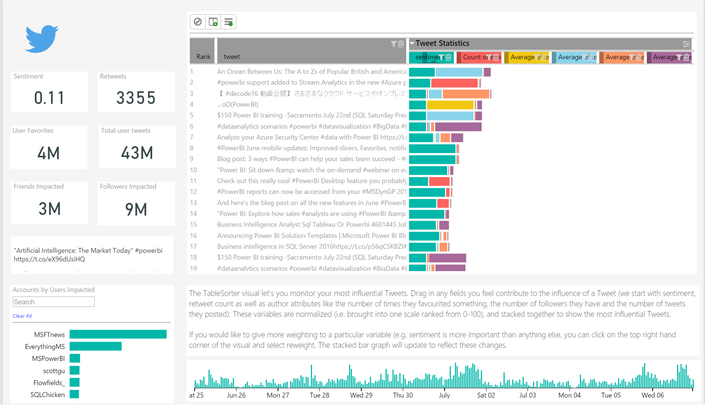

#Customizations

Updating the Solution
---------------------

Once you set up the solution template you may want to modify the search terms or accounts you are following.

If you want to change your search terms you will need to log into your Azure portal account and open your Logic App. Here is an example of what a possible Logic App could look like:


If you wanted to modify your search query you should edit the text in the **Search Text** box and save your changes.

You might also want to change the accounts (Twitter Handles) you are following. In order to do this, you will need to go into your SQL database and open the configuration table. It should look something like this:


In order to change the accounts followed you will need to modify the ‘twitterHandle’ values inside the table (row 3) as well as the ‘twitterHandleId’ value (row 4).

Row 3 can be modified by appending/deleting any of the twitter handles you are interested (please make sure they are valid handles).

Row 4 requires the corresponding ID of the added twitter handle. You can check what a corresponding ID of a twitter handle is over [here](https://tweeterid.com/).

If you are including more than one Twitter Handle ID **please make sure they are comma separated without spaces in between (like the image above)**.

Extension Suggestions
---------------------

One of the great advantages of the template is that the solution is fully customizable! We encourage you to experiment and explore new ideas on how you can make the template more specific to your needs. Here are some ideas to get started:

### Bring in additional data sources: 

Since the application stores tweets in Azure SQL you can go ahead and bring in new data sources you might want to report on as well. Get a complete picture of social media by bringing in [LinkedIn](https://developer.linkedin.com/#!), [Facebook](https://developers.facebook.com/) or [Instagram](https://www.instagram.com/developer/) data.

From a more enterprise perspective, a suggestion would be to correlate the template with your CRM data. If you are tracking CRM campaigns, or selling products you could e.g. see how your campaigns are being perceived on social media or if a drop in product sales might be linked to some negative sentiment.

### Customize your Azure Function:

The Python script inside the Azure Function is completely customizable. You can go ahead and add additional enrichments to the data. For example, if there are specific themes you are interested in you could check if any of the tweets found correspond to those themes (e.g. if I had Power BI as my search term, I could define themes like ‘price’, ‘quality’, ‘data size’ and see if the incoming tweets contain any of those words). I could then add a column to SQL to document which theme was found and use that as a slicer inside my reports.

Other examples could be to add [Cognitive APIs](https://azure.microsoft.com/en-us/services/cognitive-services/text-analytics/) to do things like topic or keyword extraction on top of the twitter data.

### Estimated Costs

Here is an estimate of the Azure costs (Logic App, Azure Function, Azure SQL, Azure ML) based on the number of tweets processed:

Processing 10K tweets a month will cost approximately $160

Processing 50K tweets a month will cost approximately $265

Processing 100K tweets a month will cost approximately $335

Please keep in mind these are **estimated costs and subject to change.** For a more detailed breakdown of the various components please refer to the [Azure calculator](https://azure.microsoft.com/en-us/pricing/calculator/) and select Logic App, Azure Function, Azure SQL and Azure ML. You can tweak all the options to see what the costs will look like and what modifications may suit your needs best.

The following defaults are set for you in the template (you can modify any of these after things get set up):

-   Azure SQL: Standard S1

-   App Service Plan: Dynamic

-   Logic Apps (trigger set for every 3 minutes)

-   Azure Functions

-   Azure ML (S1)

For example, if you know you will be processing very few tweets a month, you could change the SQL Server from S1 to Basic. In that case you could bring down the costs of processing 10K tweets a month from about $160 to about $130.

Whilst the default setting should cater to most twitter template requirements, we encourage you to familiarize yourself with the various pricing options and tweak things to suit your needs.
